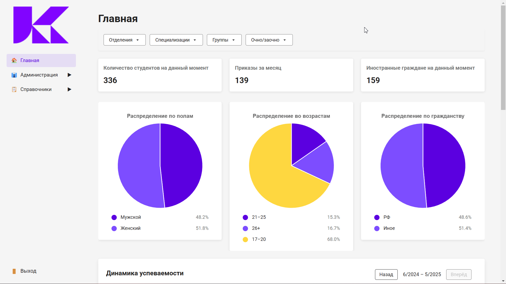

# Stein
Веб-приложение для учебного заведения. Предоставляет функции агрегации и визуализации данных, которых не хватает в существующей системе документооборота учебного заведения. 
Приложение обрабатывает данные об успеваемости и движении контингента, которые периодически импортируются из другой системы с помощью xlxs таблиц
## Функциональность
- **Регистрация и вход**
  - Регистрация с помощью панели администратора
  - Вход по логину и паролю. Пароли хэшируются
- **Импорт данных** 
  - Импорт данных из xlsx таблиц, определённого формата
- **Удаление и редактирование данных**
- **Визуализация данных**

## Демонстрация
**Дашборд:**

**Внесение данных:**

**Справочники**


## Технологии
Стек: 
- Языки:
  - С# (.NET 8)
  - JavaScript 
- Фреймворки и библиотеки:
  - ASP.NET Core
  - Entity Framework Core
  - AutoMapper, Swagger, BCrypt
  - Vue.js
  - Charts.js
- Базы данных
  - PostgreSQL
- Инструменты и прочее:
  - Git, GitHub
  - Docker

## Установка
### 1. Установи .NET 8+ и Node.js 22+
### 2. Клонируй репозиторий:
```bash
git clone https://github.com/Balalaikajun/Stein.git
```
### 3. Перейди во фронтенд и собери:
```bash
cd frontend
npm install
npm run deploy # Собирает фронтенд и переносит его в статические файлы ASP.NET
```
### 4. Разверните окружение с помощью docker-compose.yaml
```bash
cd ../backend/Configurations
docker-compose -f docker-compose.yaml up -d
```
### 5. Перейди в backend и запусти:
```bash
cd ../API
dotnet run
```
### 6.  Теперь приложение доступно по адресу https://localhost:7203